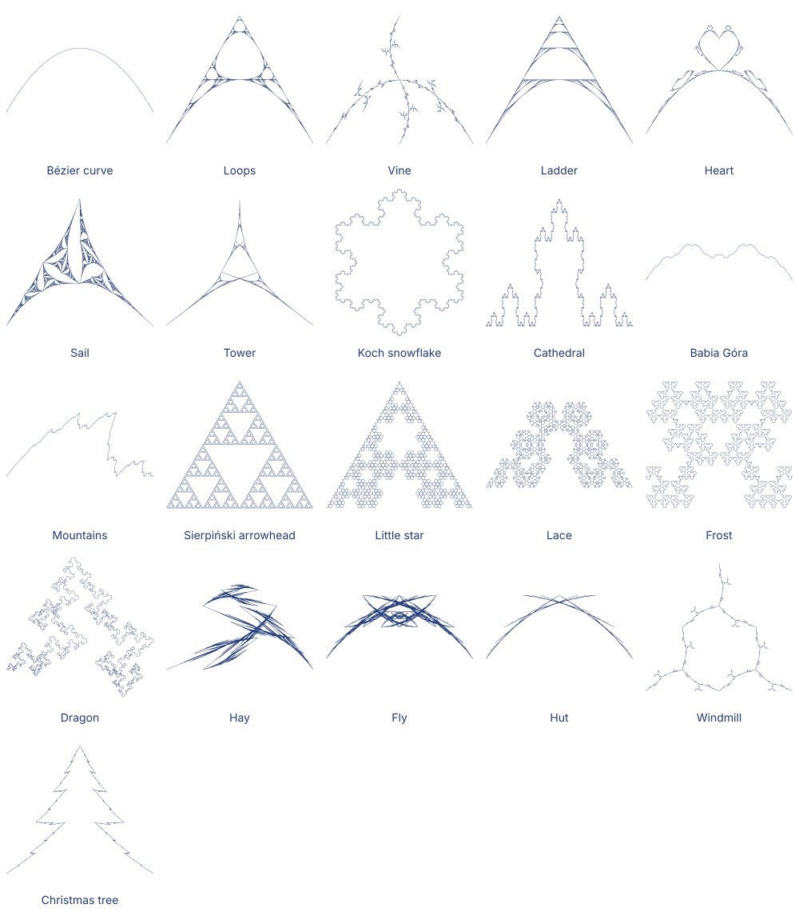
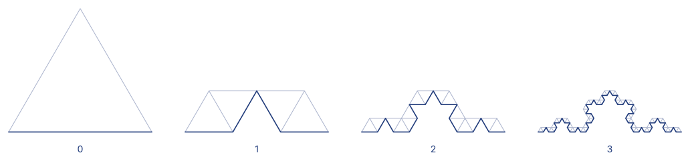

# Fraktalne krzywe Béziera

*Dostępne także po angielsku: [README](README.md)*

Krzywe rysowane przez zastępowanie trójkąta mniejszymi trójkątami, raz za razem. Jedna reguła
daje idealnie gładką krzywą Béziera, inna płatek Kocha. Reguły można zmieniać w przeglądarce na
**[bsulkowski.pl/pl/fractal-bezier](https://bsulkowski.pl/pl/fractal-bezier)**; w tym repozytorium
jest kod, który je rysuje.



## Pomysł

Trzy punkty — początek, punkt kontrolny i koniec — wyznaczają kwadratową krzywą Béziera: wychodzi
z początku w stronę punktu kontrolnego i dochodzi do końca od jego strony. Przetnij krzywą na
pół, a każda połowa znów jest taką krzywą, z własnym trójkątem, mniejszym od pierwszego
(konstrukcja de Casteljau). Zastąp każdy z dwóch trójkątów jego własnymi połowami, i jeszcze raz,
a cięciwy trójkątów zbliżają się do krzywej.

Nic nie zmusza, żeby zastępować połowami. **Reguła** to dowolna lista mniejszych trójkątów
ułożonych w dużym; stosowana raz za razem, rysuje to, co ta lista z siebie robi. Połowy krzywej
rysują krzywą, cztery trójkąty wyginające linię w górę w środkowej jednej trzeciej — krzywą
Kocha, trójkąt przebiegany od końca odbija lustrzanie wszystko, co na nim wyrasta. Każdy gotowy
trójkąt jest rysowany jako cięciwa, od początku do końca.



Regułę zapisuje się we współrzędnych dużego trójkąta, więc działa tak samo w trójkącie każdego
kształtu: `[1, 0]` to jego początek, `[0, 0]` punkt kontrolny, `[0, 1]` koniec, a punkt `[a, b]`
to *kontrolny* + *a* · (*początek* − *kontrolny*) + *b* · (*koniec* − *kontrolny*). Połowy krzywej to

```
[1, 0]     [0.5, 0]   [0.25, 0.25]
[0.25, 0.25] [0, 0.5] [0, 1]
```

gdzie `[0.25, 0.25]` to środek krzywej, a `[0.5, 0]` i `[0, 0.5]` — środki ramion.

### Rodzaje reguł

- **Gładka** — trójkąty są odcinkami krzywej dużego trójkąta, przebieganymi w którąkolwiek stronę,
  i razem pokrywają ją całą, w dwóch kawałkach albo w większej ich liczbie: rysunek zbiega do tej
  krzywej Béziera.
- **Łańcuch** — łączą się końcami od początku do końca: jedna ciągła linia, choćby najbardziej
  poszarpana (Koch, Sierpiński, Katedra).
- **Luźna** — nie łączą się: rysunek się rozgałęzia albo rozsypuje w pył (Pnącze).

Trójkąt niewiele mniejszy od tego, który zastępuje, ustalałby się bardzo długo, więc rysunek
zatrzymuje się przed poziomem, który przekroczyłby budżet kawałków, a kawałki mniejsze od
szczegółu rysunku nie są już dzielone.

### Bez koła

Parabola wychodzi dokładnie, okrąg — nigdy. Każdy krok to przekształcenie afiniczne, a ono
zamienia okrąg w elipsę; żeby mniejszy łuk okręgu był obrazem całego, przekształcenie musiałoby
przeprowadzać okrąg na niego samego, a takie niczego nie zmniejsza. Połowy samego okręgu zmieniają
się z poziomu na poziom: w trójkącie równobocznym łuku 120° jego środek leży w `[⅓, ⅓]`,
w trójkątach łuków 60° — w 0,268, dalej 0,254, 0,251… coraz bliżej ¼ paraboli. Znalezione ręcznie
Koło trzyma się okręgu z dokładnością 1,4% na podstawie z trzech łuków, a z bliska jest fraktalem.

### Podstawy

Reguła zaczyna od **podstawy**: jednego łuku (trójkąt odniesienia w edytorze, równoboczny);
trzech łuków wokół trójkąta, wygiętych na zewnątrz (reguła Kocha robi na nich płatek śniegu);
albo dwóch łuków od dolnych rogów do wspólnego szczytu, lustrzanych odbić (Choinka).

## Pochodzenie

Skrypt w Groovym z 2011 roku, który zapisywał rysunek do pliku SVG, z kształtami trzymanymi
w źródle jako listy trójkątów; większość z nich doszła w 2014 roku. Kształty są tu te same, z ⅓ i ⅔ zapisanymi dokładnie zamiast
0,33 i 0,67; nazwy pochodzą ze skryptu.

## Kod

Jeden moduł TypeScript, [`src/fractal-bezier.ts`](src/fractal-bezier.ts), bez zależności i bez
dostępu do DOM. Działa w przeglądarce i w Node ≥ 22.12 (z `--experimental-strip-types`).
Przykład użycia i parametry linku są w [README po angielsku](README.md#using-the-code).

## Licencja

[MIT](LICENSE) — Bartosz Sułkowski.
